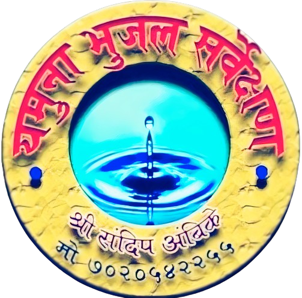

# Yamuna Bhujal Website

This repository contains the source code for the "Yamuna Bhujal" website, a project created using HTML, CSS, JavaScript, and Bootstrap. The website serves as a platform to showcase the services provided by the client, specializing in locating underground water sources and identifying bore well points.

</img>

- Project Link : [Yamuna GroundWater Survey Website.](https://yamunabhujal.netlify.app/)

## Features

- **Service Display**: The website presents detailed information about the services offered by Yamuna Bhujal, including the techniques used for finding water underground and identifying bore well points.
  
- **Responsive Design**: Utilizing Bootstrap framework and custom CSS, the website is designed to be responsive, ensuring optimal viewing experience across various devices and screen sizes.

- **Contact Form**: A contact form is integrated into the website, allowing visitors to easily reach out to the client for inquiries or service requests.

## Technologies Used

- HTML
- CSS
- JavaScript
- Bootstrap

## Usage

To view the website, simply open the `index.html` file in a web browser.
 
Or
  Click on Project Link : [Yamuna GroundWater Survey Website.](https://yamunabhujal.netlify.app/)

## License

This project is licensed under the [MIT License](LICENSE).

---

Feel free to contribute to the project by submitting issues or pull requests. For any questions or feedback, please contact [Email me](mailto:ogaikwad103@gmail.com)